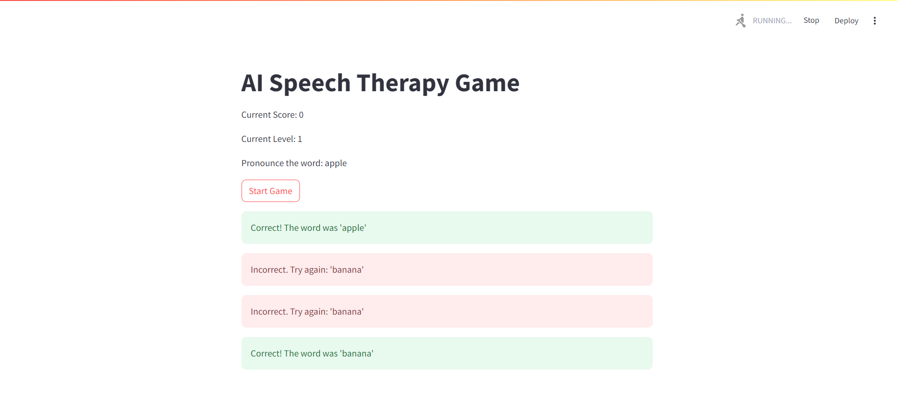
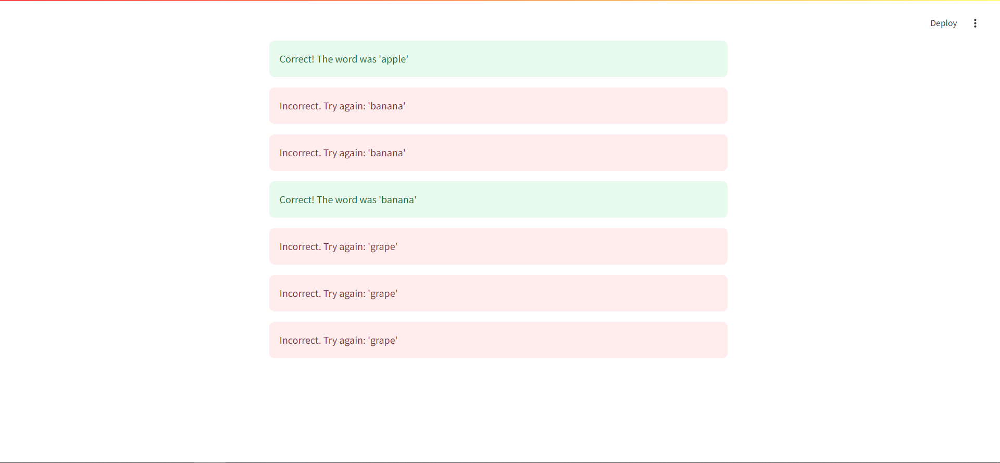

# AI Speech Therapy Game

This repository contains code for an AI-powered speech therapy game designed to assist individuals in improving their speech through interactive activities. The game provides personalized exercises and real-time feedback to make speech therapy engaging and effective.

## Features

- **Personalized Exercises**: Tailors activities based on user progress and needs.
- **Interactive Games**: Fun and engaging games to motivate users.
- **Real-Time Feedback**: Instant feedback to help users correct and improve speech.
- **Progress Tracking**: Monitors and records user progress over time.
- **Multi-Platform Support**: Available on web, mobile, and desktop.

## Technologies Used

- **Artificial Intelligence**: Machine learning algorithms for personalized therapy.
- **Speech Recognition**: Advanced technology to analyze and provide feedback on speech.
- **Game Development Framework**: Built with Unity (or your chosen framework) for an engaging experience.
- **Backend**: Node.js/Python (or your preferred backend technology) for data management.
- **Database**: MongoDB/MySQL (or your chosen database) for storing user data.

  



## Getting Started

### Clone the Repository:

```sh
git clone https://github.com/Kawinkawin/AI-Speech-Therapy-Game.git
```

### Install Dependencies:

```sh
cd AI-Speech-Therapy-Game
pip install -r requirements.txt 
```

### Run the Application:

```sh
streamlit run main.py
```

## License

This project is licensed under the MIT License. See the LICENSE file for details.

## Contact

For any questions or suggestions, open an issue or contact us at kawinprabha08@gmail.com.
